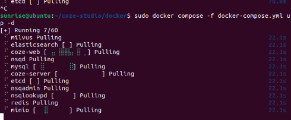
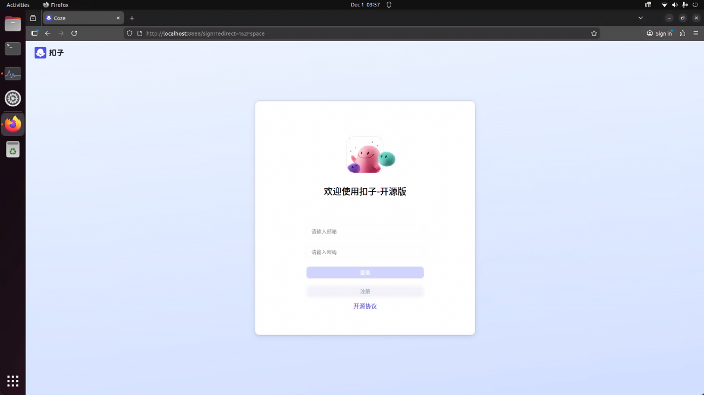

# 🤖 Sweet Potato Robot x Coze: RDK Deployment Coze Studio Practical Guide


**Compatible Hardware**: Sweet Potato Robot RDK Series (RDK X3 / X3 Module / RDK X5 / RDK S100)  

 

-----

## Step 1: Configure Docker Environment (The Most Critical Step)

Since RDK runs on an ARM architecture Ubuntu system, and due to China's special network environment, installing Docker directly can easily encounter `iptables` compatibility issues or image pull failures. Please follow these steps strictly:

### 1. Clean Up Old Versions and Conflicting Packages

To prevent environment conflicts, first clean up any existing old versions of Docker or conflicting components in the system.

```bash
sudo apt remove --purge containerd.io containerd docker-ce docker.io
sudo apt autoremove
sudo rm -rf /var/lib/docker /var/lib/containerd /etc/docker
```

### 2. Install Docker

It is recommended to use the Ubuntu official repository for installation, which offers better stability.

```bash
sudo apt update
sudo apt install docker.io
```

### 3. Resolve iptables Compatibility and Configure Domestic Mirror Sources

This is a **mandatory** step. RDK systems typically use `nftables`, while Docker defaults to `iptables-legacy`, which will cause startup errors. At the same time, we need to configure mirror sources to accelerate downloads.

Please execute the following command directly to create the configuration file:

```bash
sudo mkdir -p /etc/docker
sudo tee /etc/docker/daemon.json > /dev/null <<EOF
{
    "iptables": false,
    "registry-mirrors": [
        "https://docker.1panel.live/",
        "https://docker.1ms.run",
        "https://docker.xuanyuan.me",
        "https://docker.xpg666.xyz/",
        "https://dytt.online",
        "https://lispy.org",
        "https://docker.xiaogenban1993.com",
        "https://docker-0.unsee.tech",
        "https://666860.xyz",
        "https://docker.m.daocloud.io",
        "https://docker.nju.edu.cn",
        "https://hub.rat.dev"
    ]
}
EOF
```

> **Configuration Notes**:
>
> * `"iptables": false`: Resolves the `Could not fetch rule set generation id` error.
> * `"registry-mirrors"`: Uses commonly used domestic Docker image acceleration addresses to solve download lag issues.

### 4. Restart Docker and Verify

Apply the configuration and check if the installation was successful.

```bash
sudo systemctl daemon-reload
sudo systemctl restart docker
sudo docker version  # Should be able to see Client and Server version information
```

### 5. Install Docker Compose

Coze Studio needs to be started via Docker Compose.

```bash
sudo apt install docker-compose-plugin
docker compose version  # Verify successful installation
```

-----

## Step 2: Download Coze Studio Project Code

After preparing the environment, we will clone the Coze Studio code to the local machine.

Return to the user home directory

```bash
cd ~
```

Clone the code repository

```bash
git clone https://github.com/coze-dev/coze-studio
```

-----

## Step 3: Start Services

Everything is ready, let's start the deployment!

1. Enter the docker directory

<!-- end list -->

```bash
cd ~/coze-studio/docker
```

2. Copy the environment variable file

<!-- end list -->

```bash
cp .env.example .env
```

3. Start services (using docker compose)

<!-- end list -->

```bash
sudo docker compose -f docker-compose.yml up -d
```

At this point, you will see the terminal displaying `Pulling` (downloading) various images. Please wait patiently for the download to complete.



-----

## Step 4: Register Account and Configure Model

After all containers show `Started`, we will proceed with subsequent configuration through the browser:

1. **Register Account**:
   Open your browser and visit `http://localhost:8888/sign` (or `http://<RDK_IP_Address>:8888/sign`), enter your username and password, and click the register button.

2. **Configure Model** (Connecting Doubao 1.6):
   After logging in, visit `http://localhost:8888/admin/#model-management` (or navigate to the model management page through the interface) to add a new model.

     * *Note: This feature requires Coze Studio image version greater than or equal to 0.5.0.*
     * **Configuration Information Acquisition**:
         * **API Key**: [Click here to create/view](https://www.volcengine.com/docs/82379/1541594)
         * **Endpoint ID (Inference Access Point)**: [Click here to create](https://console.volcengine.com/ark/region:ark+cn-beijing/endpoint/create?customModelId=) (After creating the access point, the characters displayed in the red box on the page are your Endpoint ID)

3. **Start Using**:
   After configuration is complete, visit the Coze Studio homepage `http://localhost:8888/` to start creating Agents! 🚀



-----

## Appendix: Common Issues and Core Troubleshooting (Troubleshooting)

If you encounter issues such as containers failing to start, services failing to connect, or "Internal Server Error" during deployment, please refer to the following core solutions.

### 1. Core Diagnostic Commands

When encountering issues, please prioritize executing the following commands to check error details rather than blindly reinstalling.

  * **Check Container Running Status**:

    ```bash
    cd ~/coze-studio/docker
    sudo docker compose ps
    ```

    *In normal state, all services' Status should be `Up (healthy)` or `Up`. If there is `Exit` or `Unhealthy`, please continue to the next step.*

  * **Check Key Service Logs (Core!!!)**:
    Most errors (such as 500 errors, connection timeouts) are hidden in the logs.

    ```bash
    # Check backend service logs (resolve Internal Server Error)
    sudo docker logs --tail 100 coze-server

    # Check vector database logs (resolve Milvus startup failure)
    sudo docker logs --tail 100 coze-milvus
    ```

### 2. Network and Startup Errors (iptables/DNS)

If the logs show `dial tcp ... connection refused`, `context deadline exceeded`, or `lookup ... failed`, it's usually a network forwarding issue with RDK.

  * **Check 1: Whether Docker configuration disables iptables**
    Ensure that `/etc/docker/daemon.json` must contain `"iptables": false`, because the RDK kernel may be missing certain firewall modules.

    ```bash
    sudo cat /etc/docker/daemon.json
    # Must confirm it includes: "iptables": false
    ```

  * **Check 2: Enable IPv4 Forwarding**
    If iptables is disabled, kernel forwarding must be manually enabled, otherwise containers cannot access the internet.

    ```bash
    # Temporary enable (takes effect immediately)
    sudo sysctl -w net.ipv4.ip_forward=1

    # Verify
    cat /proc/sys/net/ipv4/ip_forward
    # Output 1 is normal
    ```

### 3. Milvus Vector Database Stuck or Error on Startup

Milvus is the most complex component, depending on Etcd and MinIO. If it reports `connect to etcd failed` or `check blob bucket exist failed`:

  * **Cause**: Usually due to IP address changes of dependent services (MinIO/Etcd), or they start slower than Milvus.
  * **Solution**:
    No need to modify configuration files, simply restart the Milvus container to let it reacquire the IP of dependent services:
    ```bash
    cd ~/coze-studio/docker
    sudo docker compose restart milvus
    ```
    Wait a few seconds, then check the logs again to confirm `Proxy successfully started` appears.

### 4. Coze Studio Page Blank or 500 Error

  * **Blank Page**: Usually browser cache or unopened port. Try force refresh (Ctrl+F5) or check if the RDK IP is correct.
  * **500 Internal Server Error**:
    1. Check if a model has been configured in the Web interface (see Step 4).
    2. Check if the `coze-server` container is connected to Milvus (see "Check Key Service Logs" above).
    3. Try restarting the backend service:
        ```bash
        sudo docker compose restart coze-server
        ```

### 5. Extreme Case: Reset All Environment

If the environment is completely messed up (such as severe IP conflicts), you can execute the following commands to completely clear and rebuild (**Note: This will delete all created Agent data**):

```bash
cd ~/coze-studio/docker
sudo docker compose down -v  # Delete containers and data volumes
sudo systemctl restart docker # Restart Docker daemon
sudo docker compose up -d    # Rebuild
```